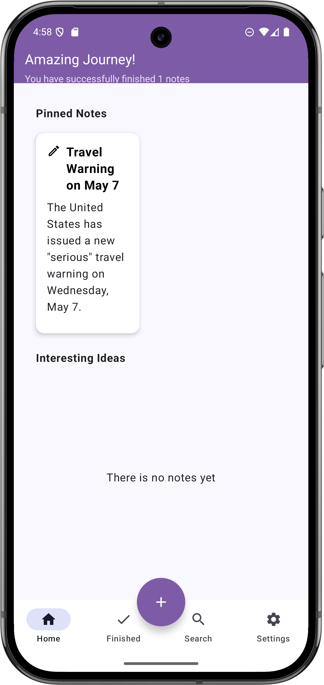
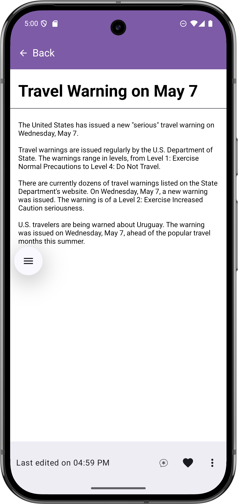
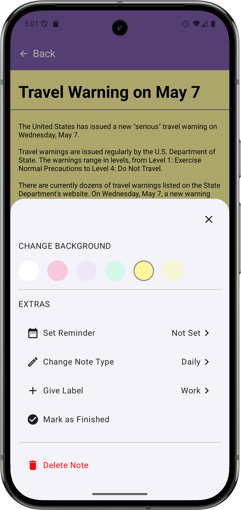
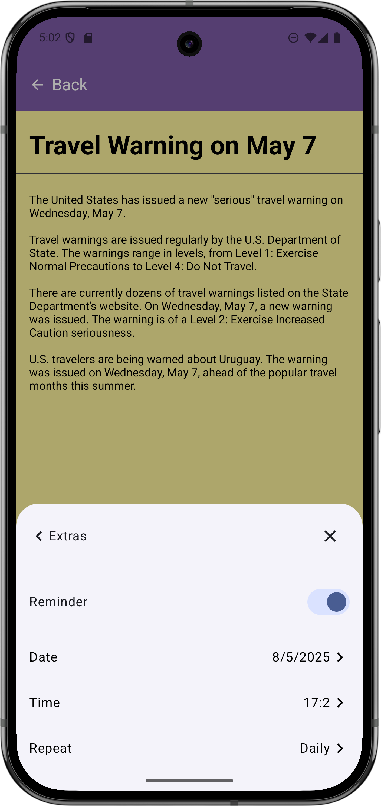
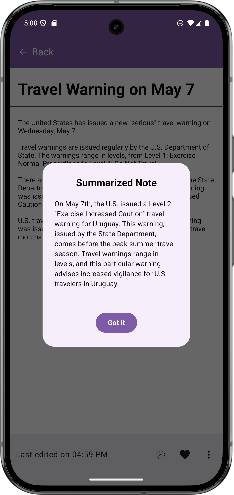

# NoteApp

---

## Table of Contents

1.  [Overview](#overview)
2.  [Features](#features)
3.  [Technical Architecture](#technical-architecture)
4.  [Project Flow](#project-flow)
5.  [Screenshots](#screenshots)
6.  [Getting Started](#getting-started)
7. [Skills Demonstrated](#skills-demonstrated)
8. [License](#license)
9. [Contributors](#contributors)
10. [Contact](#contact)

---

## Overview

**NoteApp** is a user-friendly Android note-taking application designed to help you efficiently create, manage, and organize your notes. It provides a seamless experience for jotting down ideas, setting reminders, and staying on top of your tasks. With **NoteApp**, you can easily create new notes, edit existing ones, delete unnecessary entries, and save important information. The application also features a reminder system, ensuring you never miss an important event or deadline. When a reminder is active, the application will show a notification at the selected time and date.

---

## Features

*   **Note Management:**
    *   ***Creation***: Easily create new notes with a simple and intuitive interface.
    *   ***Editing***: Modify existing notes quickly and efficiently.
    *   ***Deletion***: Remove unwanted notes with a straightforward delete option.
    * ***Saving***: Save your notes to not lose information.
*   **Reminder Scheduling:**
    *   Set reminders for your notes to ensure you are notified at the right time.
    *   Choose a specific date and time for each reminder.
*   **Notifications:**
    *   Receive timely notifications for your scheduled reminders, keeping you informed about important tasks.
* **AI Summarization**:
    * NoteApp provides an AI-powered summarization capability. By leveraging the Gemini API, the app can generate concise summaries of your notes.

---

## Technical Architecture

The project follows a clean architecture approach, which promotes separation of concerns and makes the codebase more maintainable and testable.

*   **Data Layer:**
    *   ***Local Database***: Utilizes **Room**, an abstraction layer over SQLite, for local data persistence. Room was chosen for its ease of use, compile-time query verification, and integration with LiveData and Coroutines.
*   **Domain Layer:**
    *   ***Use Cases***: Contains the business logic of the application. Use cases define the actions that can be performed (e.g., `SaveNoteUseCase`, `GetNotesUseCase`, `DeleteNoteUseCase`, `ScheduleReminderUseCase`). This layer is independent of any framework and is responsible for encapsulating the business rules.
    * ***Gemini Repository***: The app uses the gemini api to make a summarization of the notes.

*   **Presentation Layer:**
    *   ***ViewModels***: Manages UI-related data and communicates with the domain layer. ViewModels survive configuration changes, preventing data loss.
    *   ***Jetpack Compose UI***: The application's user interface is built using Jetpack Compose, a modern UI toolkit that simplifies and accelerates UI development.
*   **Dependency Injection:**
    *   ***Hilt***: Manages dependencies throughout the application, making it easier to maintain and test the code. Hilt was chosen because it is built on top of Dagger and simplifies dependency injection in Android.
*   **Navigation:**
    *   ***Jetpack Compose Navigation***: Handles navigation between different screens in the application, ensuring a smooth and consistent user experience.
*   **Notification:**
    * ***WorkManager***: Schedule reminder when date and time is reached.
    * ***NotificationCompat***: Build the notification that the user will see.

---

## Project Flow

Here's a detailed description of how the application works:

1.  **App Launch:**
    *   The user opens the **NoteApp**, and the home screen is displayed.
2.  **Home Screen:**
    *   The home screen lists all saved notes, and the user can visualize them.
3.  **Creating a New Note:**
    *   The user taps the "New Note" button to create a new note.
    *   The note detail screen opens, allowing the user to enter the content of the note.
    *  The user can choose a time and date to set a reminder.
    *   The user taps the "Save" button, and the note is saved to the local database using Room.
    *   The user returns to the home screen, where the new note is now displayed.
4.  **Editing an Existing Note:**
    * The user can ask for a summarization by clicking on the summarization button.
    *  The app calls the Gemini API to generate the summarization.
    * The summarization will be shown in the UI.
5.  **Editing an Existing Note:**
    *   The user selects a note from the home screen to edit.
    *   The note detail screen opens, populated with the existing note content.
    *   The user makes the desired changes.
    *  The user can change the reminder date and time.
    *   The user taps the "Save" button, and the updated note is saved to the local database.
    *   The user returns to the home screen, where the modified note is now displayed.
5.  **Deleting a Note:**
    *   The user selects a note from the home screen to delete.
    *   The user is prompted to confirm the deletion.
    *   Once confirmed, the note is removed from the local database, and it is no longer displayed on the home screen.
6. **Reminder:**
    * The application check date and time and when the specified time and date are reached.
    * The application shows the notification to the user.

---

## Screenshots

### Home Screen

### Note Detail Screen

### Note Summarization Screen

---

## Skills Demonstrated

This project demonstrates proficiency in the following areas:

*   **Clean Architecture:** The project is structured according to clean architecture principles, separating the codebase into distinct layers (data, domain, and presentation). This enhances modularity, testability, and maintainability.
    *   **Example:** The separation of use cases in the `damain` package, independent of UI and data.
*   **MVVM (Model-View-ViewModel):** The application uses the MVVM pattern to manage UI state and logic. ViewModels hold UI data and handle user interactions.
    *   **Example:** `HomeViewModel` and `NoteDetailViewModel` in the `presentation.viewmodel` package.
*   **Room:** Demonstrates the use of Room for local data persistence, including entity definitions, DAOs, and database setup.
    *   **Example:** `NoteDao` and `NoteDatabase` in the `data.local` package.
*   **Jetpack Compose:** The UI is built entirely with Jetpack Compose, showcasing knowledge of declarative UI development, composable functions, and state management.
    *   **Example:** All files in the `presentation.ui.components` and `presentation.ui.screens` packages.
*   **WorkManager:** Used to schedule tasks, such as periodic reminders, ensuring they are executed correctly even if the app is not in the foreground.
    *   **Example:** `DateTimeReminderSaver` in the `core.utils` package
*   **Notifications:** Implements a notification system for reminders.
    * **Example**: `NotificationHelper` in the `core.utils` package.
*   **Hilt:** Demonstrates the use of Hilt for dependency injection, providing a structured way to manage dependencies.
    *   **Example:** `AppModule` in the `core.di` package.
*   **Jetpack Compose Navigation:** Implements navigation between screens using Jetpack Compose Navigation, providing a smooth navigation experience.
    *   **Example:** `NavGraph` in the `core.navigation` package.

---

## Contributors

*   Siddhant Nirhali (https://github.com/siddhantnirhali)

---
## Contact

For questions and suggestions, please contact siddhant7362@gmail.com .